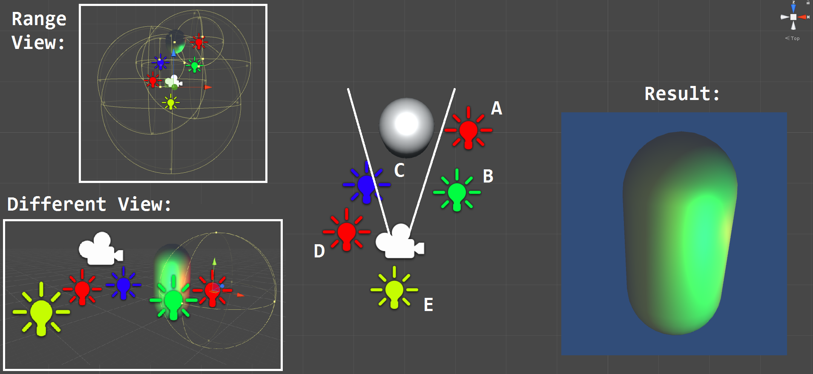
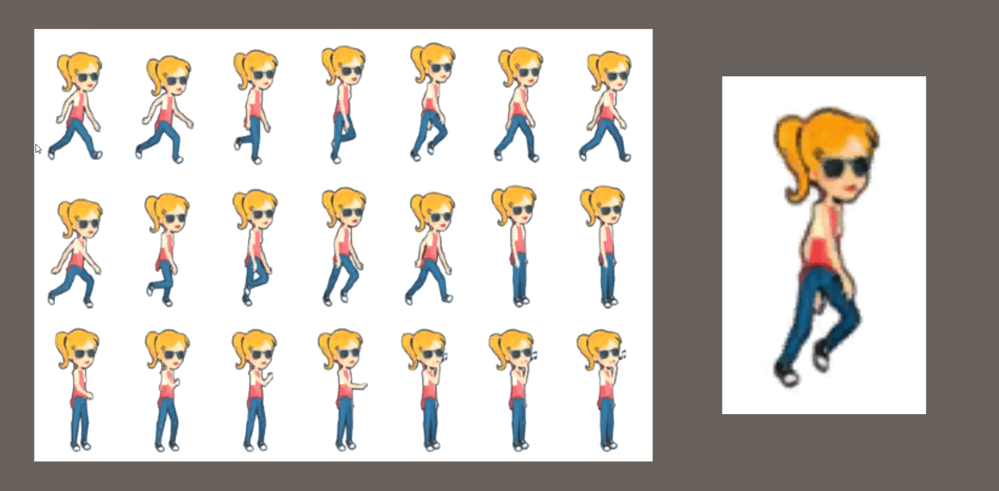
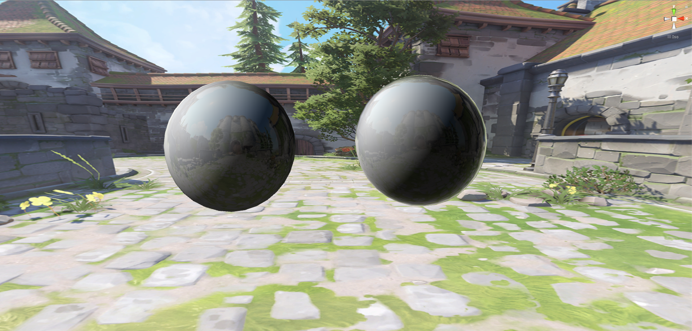
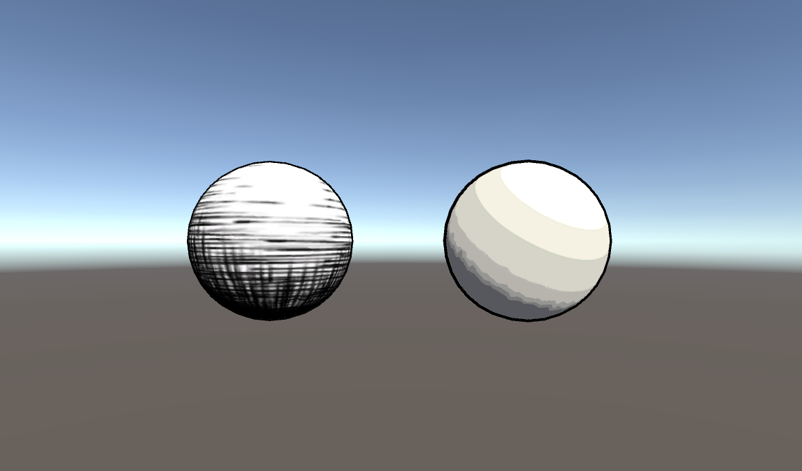
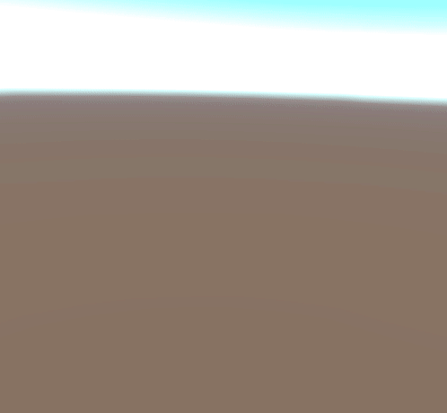
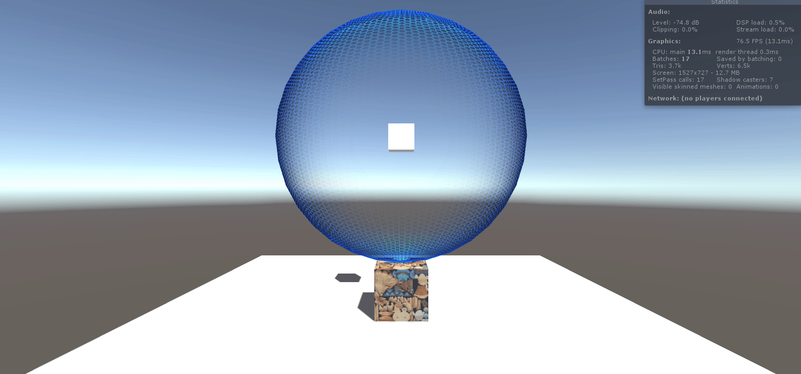
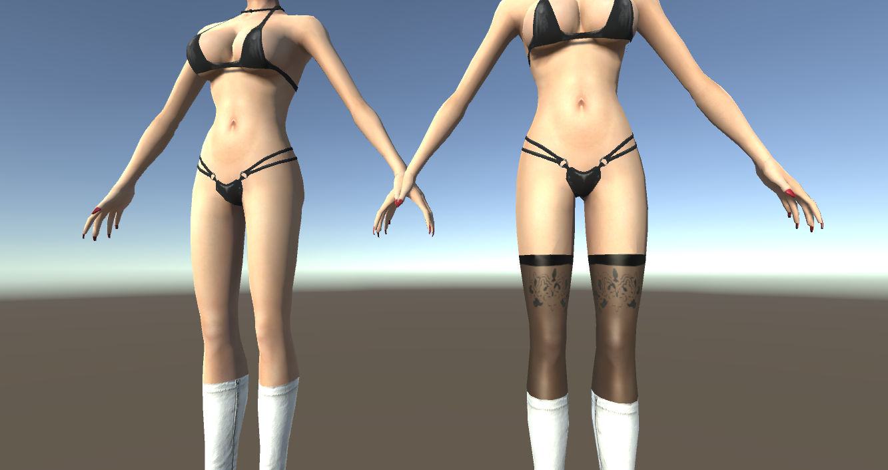
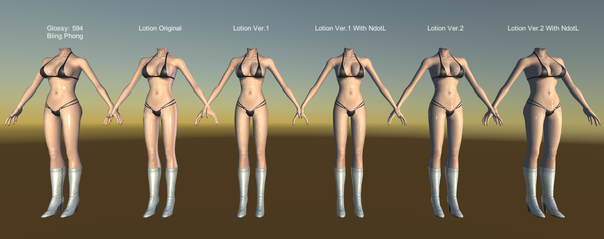

# Unity_Shader_Learn

Unity Version: 2017.2.1f1

## Assets Credits:

> UnityChan SD Character

> [Textures.com](https://www.textures.com/)

 

## Tutorials are from:

> [k79k06k02k/Shader_BookClub](https://github.com/k79k06k02k/Shader_BookClub)

> [Unite Europe 2016 - A Crash Course to Writing Custom Unity Shaders!](https://www.youtube.com/watch?v=3penhrrKCYg)

> [遊戲大師天堂路：只有Unity Shader才能超越Unity](http://www.books.com.tw/products/0010739461)

> [《Unity Shader入门精要》源代码](https://github.com/candycat1992/Unity_Shaders_Book)

> [阿祥的開發日常](https://tedsieblog.wordpress.com/)

> [【浅墨Unity3D Shader编程】](http://blog.csdn.net/zhmxy555/article/list/1)

> [巴哈姆特 kilufodo](https://home.gamer.com.tw/homeindex.php?owner=kilufodo)

> [vux427/ForceFieldFX](https://github.com/vux427/ForceFieldFX)

> [【足控福利】丝袜化MME【绅士必入】](http://tieba.baidu.com/p/3159024840)

> [ストッキングっぽい陰影を付けるエフェクト (上面那個沒有被修改過的原版)](https://bowlroll.net/file/7586)

> [keijiro/KinoGlitch](https://github.com/keijiro/KinoGlitch)

> [Wave Propagation Effect](https://www.shadertoy.com/view/Xsd3DB)

> [Finite Water](https://www.shadertoy.com/view/4sd3WB)

> [ya7gisa0/Unity-Wave-Propagation-Water-Ripple](https://github.com/ya7gisa0/Unity-Wave-Propagation-Water-Ripple) (However I suggest to use this [version](https://github.com/yanagiragi/Unity-Wave-Propagation-Water-Ripple))

> [ぬるてかシェーダー(dAdultsShader)](https://bowlroll.net/file/16903)

> [MME-Black-Rock-Shooter-Sexy-Lotion-Shader(上面那個Shader英文化的版本)](https://harryhack91.deviantart.com/art/MME-Black-Rock-Shooter-Sexy-Lotion-Shader-478042653)

> [水面を作ってみた](http://esprog.hatenablog.com/entry/2018/01/10/000942)

> [EsProgram/WaveShaderDemo](https://github.com/EsProgram/WaveShaderDemo)

 

# Previews:

* From Left to Right :

    * Direction Offset

    * Streamer Color

    * Fade

    * Outline(Normal)

    * Direction Offset + Streamer Color

    * ZTest

    * Mask Texture Clip + Direction Offset

    * Dissolve

    * Refraction Invisible

    * World Position

    * Ramp (implemented with surface shader)

    * Normal in world space

    * Noise

    * Mosaic

    * Rim

 

* From Left to Right :

    * Diffuse in vertex level

    * Diffuse in pixel level

    * Half Lambert

    * Specular in vertex level

    * Specular in pixel level

    * Blinn-Phong

 

* From Left to Right :

    * Single Texture (Texture + Bling-Phong)

    * Normal in tangent space

    * Normal in world space

    * Ramp (implemented with vertex fragment shader)

 

* Above picture is the main texture, From Left to Right :

    * Alpha Blend + Double Pass

    * Alpha Blend + ZTest

    * Alpha Blend

    * Alpha Test

    * Original Ring (Standard surface shader)

 

 

* Alpha Series Artifacts: (Alpha Blend + Double Pass is Recommended!)

* From Left to Right :

    * Alpha Blend (Causing Z-Fighting)

    * Left: Alpha Blend + ZTest (Wrong), Right: Alpha Blend + Double Pass (Correct)

 

* Basic Lightning vertex fragment Shader (implemented with Bling-Phong)

    * For A ~ E point lights: their intensities are 5.0, 4.0, 3.0, 1.0, 2.0

    * Since Unity only consider at most 4 lights, the light D are not considered

 

* Basic Lightning & Cast/Recieve Shadow vertex fragment Shader (implemented with Bling-Phong)

    * A is point light with white color
    * B is directional light colored white, angle marked as white vector in the picture
    * The angle of B is (50.587, -32.592, 31.197)
    * Note that there is another wall in Scene Geometry clipped by the camera.

 

* Basic Lightning & Cast/Recieve Shadow Shader With Alpha Test (implemented with Bling-Phong)

    * implemented by configure Fallback as "Transparent/Cutout/VertexLit"
    * Light info: Directional Light colored white with angle (82.413, 15.049, 251.738)

 

* 2D Sprite Animation

   

* Fresnel & Reflect & Refract & Glass Effect

    * Glass Effect implemented by Conbine bump, refract, reflect, uv shift

 

* Comparsion to Reflect & Frensel

 

* Trying to make refelct more realistic

    * Trying Combining Lambertian with Reflect

    * I use Diffuse * Lerp(Diffuse + specular, ReflColor) to approach, however there might be a better solution

    * Shadow artifacts due to bias (Unity can only increase bias to 2!)

 

* 2D Image Sequence, Scrolling background water sprite and billboard

 

* Some Post Processing Effects

    * (Shown in gif) Brightness, Luminance, Contrast, Gaussian Blur, Bloom, Sobel edge detection

    * (Not Shown in gif) Motion Blur (Use Depth map or not), alternate edge detection using depth map, fog

 

* Hatching Effect & Toon Shading

    * Hatching is simple version of [Matthew Webb, Emil Praun,Adam Finkelstein and Hugues Hoppe, Fine Tone Control in Hardware Hatching, SIGGRAPH, 2001]

    * Toon Shading is simpling outline + ramp

 

* Dissolve + Bloom + Brightness & Contrast

 

* Water Effect using noise with refraction

 

* Screen space fog using noise & depth map

 

* Shield Effects

 

* Stockingize Effect to create Stocking

 

* Screen Space Wave Propagation Effect

 

* Lotion Effects (See original size screenshot for checking it's effect)

 

* Wave Effect with collision and reflect surface

 