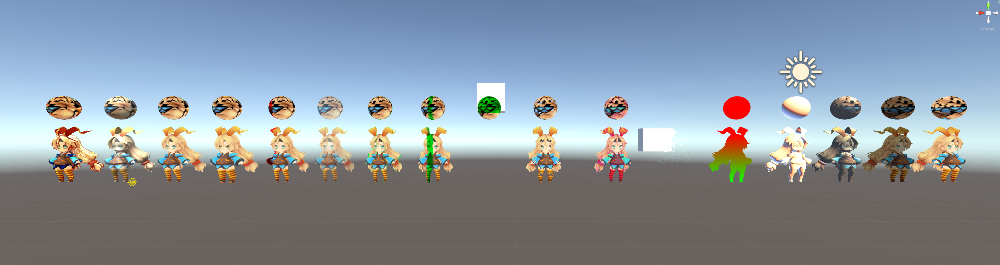
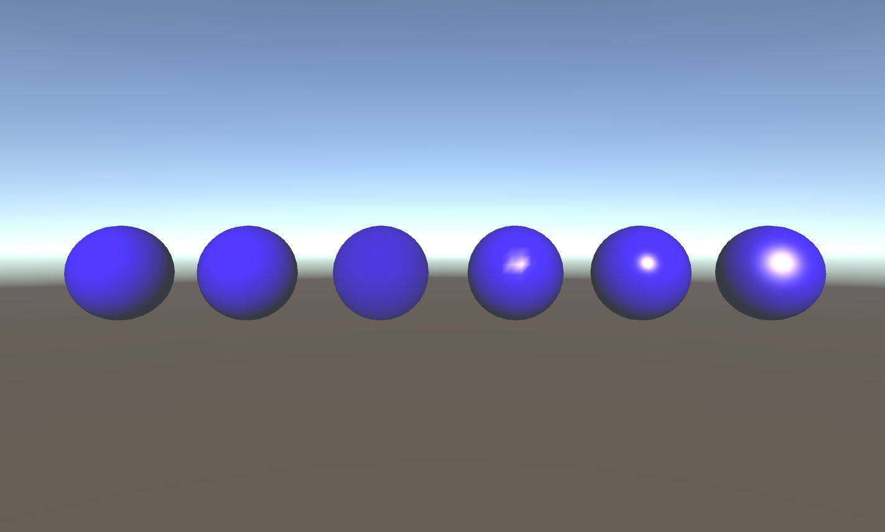
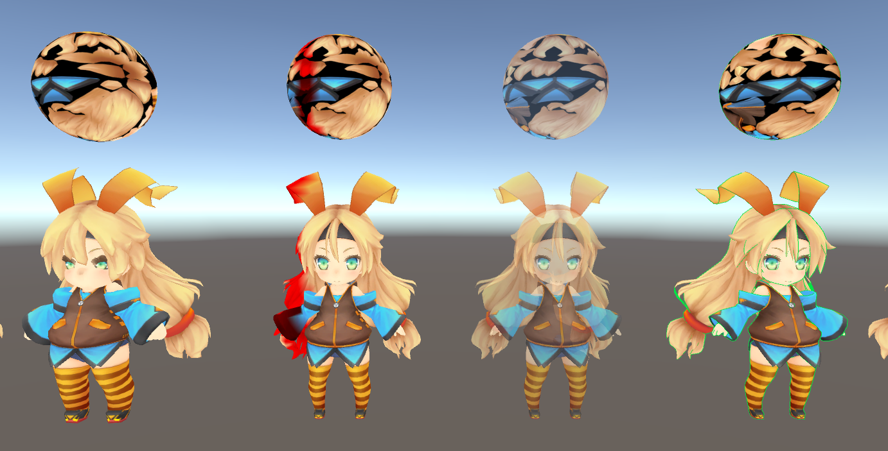
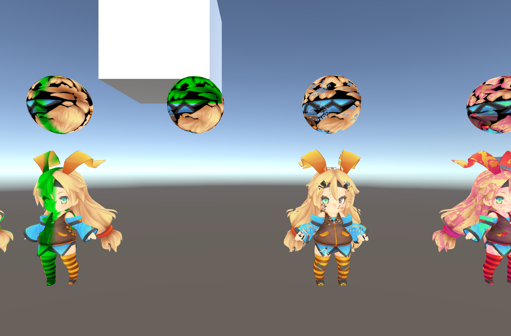
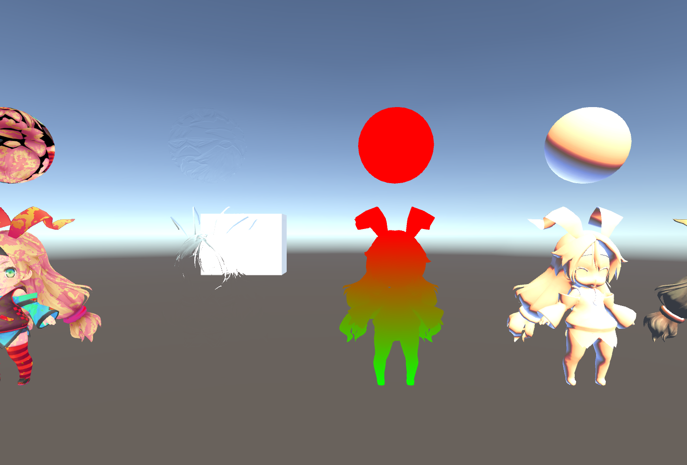
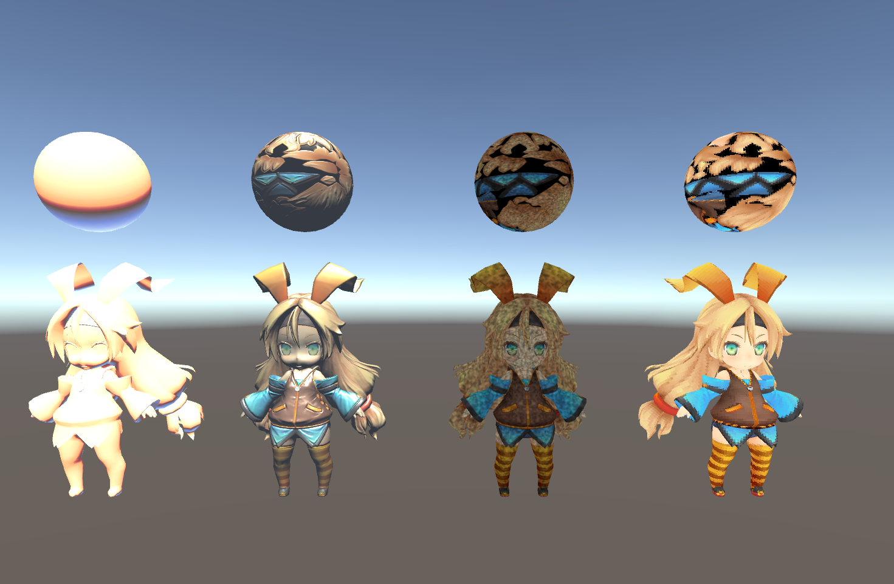

## Unity_Shader_Learn

### Assets Credits:

> UnityChan SD Character

> [Textures.com](https://www.textures.com/)

### Tutorials are from:

> [k79k06k02k/Shader_BookClub](https://github.com/k79k06k02k/Shader_BookClub)

> [Unite Europe 2016 - A Crash Course to Writing Custom Unity Shaders!](https://www.youtube.com/watch?v=3penhrrKCYg)

> [遊戲大師天堂路：只有Unity Shader才能超越Unity](http://www.books.com.tw/products/0010739461)

> [阿祥的開發日常](https://tedsieblog.wordpress.com/)

> [
【浅墨Unity3D Shader编程】](http://blog.csdn.net/zhmxy555/article/list/1)

### Previews:

Direction Offset, Streamer Color, Fade, Outline(Normal),

Direction Offset + Streamer Color, ZTest, Mask Texture Clip + Direction Offset,

Dissolve, Refraction Invisible, World Position, Ramp,

Bump, Noise, Mosaic

(Diffuse in vertex level, Diffuse in pixel level, Half Lambert, Specular in vertex level, Specular in pixe; level, Blinn-Phong)

<!--

(Direction Offset, Streamer Color, Fade, Outline(Normal))

(Direction Offset + Streamer Color, ZTest, Mask Texture Clip + Direction Offset, Dissolve)

(Dissolve, Refraction Invisible, World Position, Ramp)

(Diffuse in vertex level, Diffuse in pixel level, Half Lambert, Specular in vertex level, Specular in pixe; level, Blinn-Phong)

(Ramp, Bump, Noise, Mosaic)
-->
