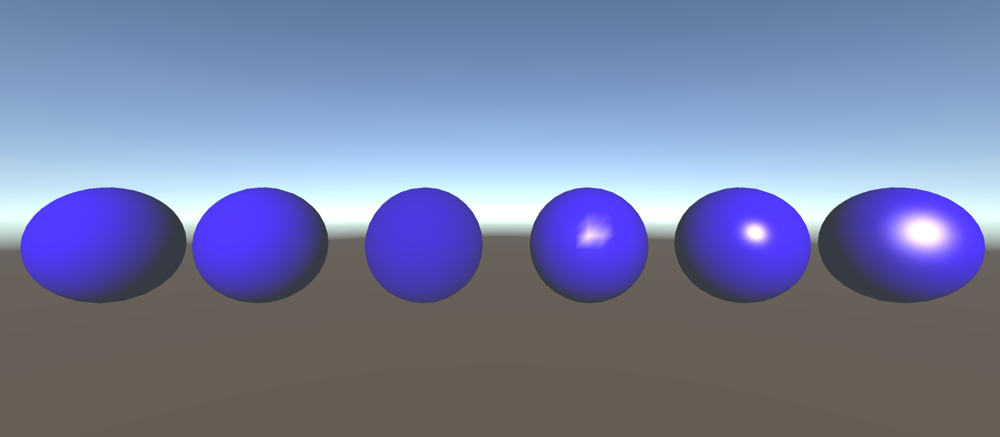
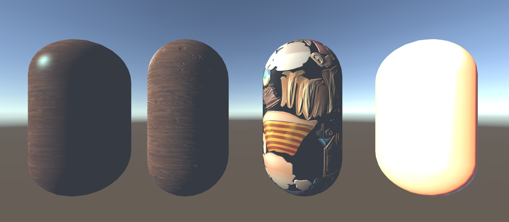
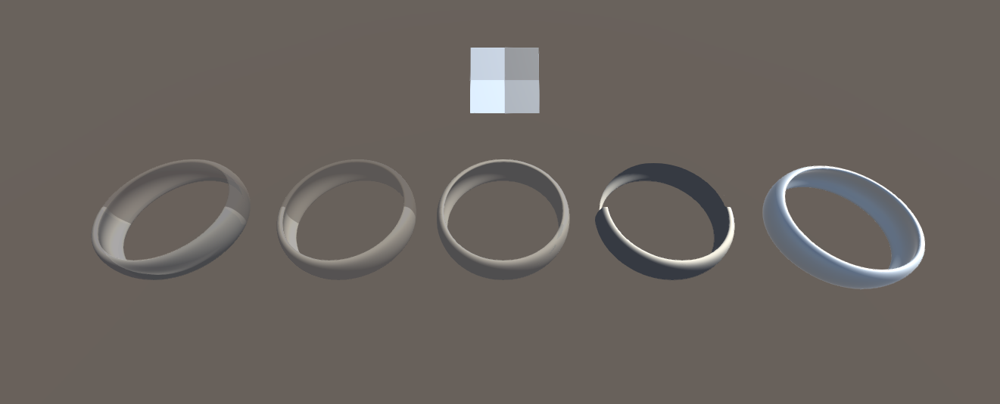
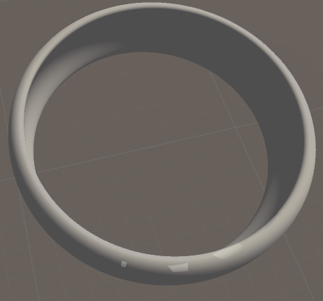
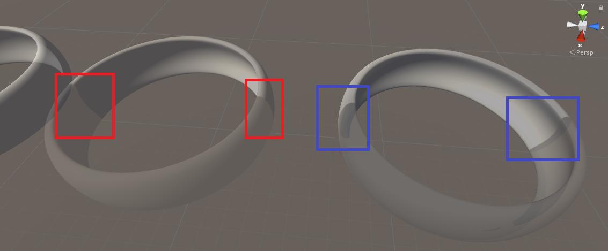
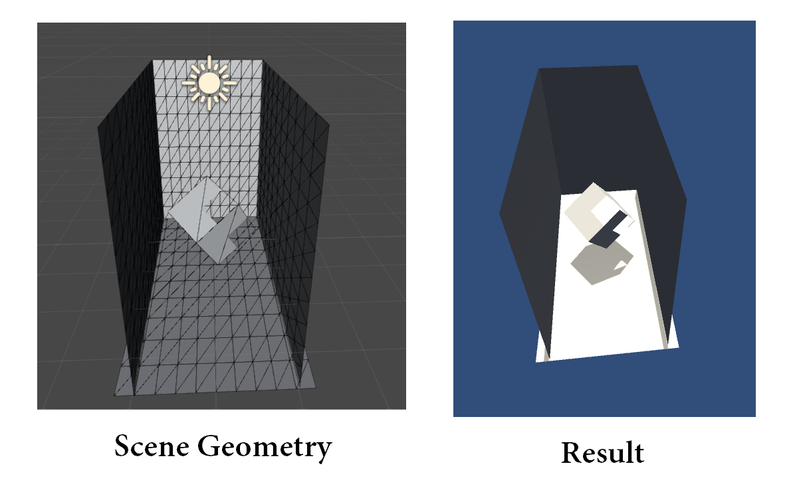

# Unity_Shader_Learn

## Assets Credits:

> UnityChan SD Character

> [Textures.com](https://www.textures.com/)

 

## Tutorials are from:

> [k79k06k02k/Shader_BookClub](https://github.com/k79k06k02k/Shader_BookClub)

> [Unite Europe 2016 - A Crash Course to Writing Custom Unity Shaders!](https://www.youtube.com/watch?v=3penhrrKCYg)

> [遊戲大師天堂路：只有Unity Shader才能超越Unity](http://www.books.com.tw/products/0010739461)

> [阿祥的開發日常](https://tedsieblog.wordpress.com/)

> [【浅墨Unity3D Shader编程】](http://blog.csdn.net/zhmxy555/article/list/1)

 

# Previews:

* From Left to Right :

    * Direction Offset

    * Streamer Color

    * Fade

    * Outline(Normal)

    * Direction Offset + Streamer Color

    * ZTest

    * Mask Texture Clip + Direction Offset

    * Dissolve

    * Refraction Invisible

    * World Position

    * Ramp (implemented with surface shader)

    * Normal in world space

    * Noise

    * Mosaic

    * Rim

 

* From Left to Right :

    * Diffuse in vertex level

    * Diffuse in pixel level

    * Half Lambert

    * Specular in vertex level

    * Specular in pixel level

    * Blinn-Phong

 

* From Left to Right :

    * Single Texture (Texture + Bling-Phong)

    * Normal in tangent space

    * Normal in world space

    * Ramp (implemented with vertex fragment shader)

 

* Above picture is the main texture, From Left to Right :

    * Alpha Blend + Double Pass

    * Alpha Blend + ZTest

    * Alpha Blend

    * Alpha Test

    * Original Ring (Standard surface shader)

 

* Alpha Series Artifacts: (Alpha Blend + Double Pass is Recommended!)

* From Left to Right :

    * Alpha Blend (Causing Z-Fighting)

    * Left: Alpha Blend + ZTest (Wrong), Right: Alpha Blend + Double Pass (Correct)

 

* Basic Lightning vertex fragment Shader (implemented with Bling-Phong)

    * For A ~ E point lights: their intensities are 5.0, 4.0, 3.0, 1.0, 2.0

    * Since Unity only consider at most 4 lights, the light D are not considered

 

* Basic Lightning & Cast/Recieve Shadow vertex fragment Shader (implemented with Bling-Phong)

    * A is point light with white color
    * B is directional light colored white, angle marked as white vector in the picture
    * The angle of B is (50.587, -32.592, 31.197)
    * Note that there is another wall in Scene Geometry clipped by the camera.

 

* Basic Lightning & Cast/Recieve Shadow Shader With Alpha Test (implemented with Bling-Phong)

    * implemented by configure Fallback as "Transparent/Cutout/VertexLit"
    * Light info: Directional Light colored white with angle (82.413, 15.049, 251.738)

 

<!--

* 2D Sprite Animation

    // To Be Done...

-->